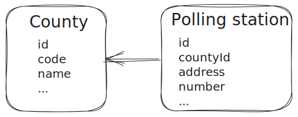
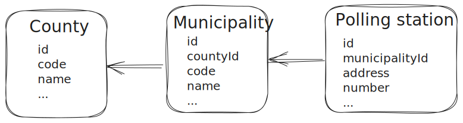

# Vote monitor polling stations 1.*
In the v1.0 implementation, we modeled our database according to the administrative division of Romania i.e. county. 
Each **county** had 1..n **polling station** within that county polling stations had a unique identifier **number**



During the preparations for the Polish elections in 2023 we encountered a different administrative division. 
The territory of Poland is divided into voivodeships (provinces);
these are further divided into powiats (counties or districts), and these in turn are divided into gminas (communes or municipalities). [source](https://en.wikipedia.org/wiki/Administrative_divisions_of_Poland)

After consulting with Polish elections data sheets ([see here](https://wybory.gov.pl/sejmsenat2023/en/dane_w_arkuszach)) we noticed that polling stations within a county do not have unique numbers. To identify a polling station we had to add a new subdivision called municipality. 

Our database model in **v1.5** became:



> **_NOTE:_** Voivodeships are being ignored so it will not complicate our data models and minimize changes in mobile apps.


As you can see our model is not flexible enough thus forcing us to change our code base every time we want to support a different administrative division. 

This approach is not viable since we want to deploy it once and use it for any country with any administrative division.

# Vote monitor polling stations 2.0
## Background
The main purpose of the election monitoring ecosystem is to let observers specify in which polling station they are at a given moment and fill in forms and/or notes regarding that polling station. Forms and/or notes are sent to our API and stored for further processing.

Each country has it's own administrative division and our API should not be a cookie cutter and enforce countries to comply with our naming and model. Also, the country's administrative division should not force us to change our code base every time we want to support them in our system.

Depending on the election type a country can have polling stations abroad (diaspora) and our data modeling should consider that as well.

## What are we trying to achieve:
A configurable and country-agnostic polling station with unique identification.

## Why we need it:
We want to deploy our solution once and be able to accommodate different countries, different election types, etc.

## How:
Our system should not know and not care about the administrative division of any country!

In V2.0 a polling station has an id, displayOrder, address, and a list of tags. 
That's it no more counties, municipalities etc!


Polling stations have the following rules:
* Each polling station should have at least 1 tag. 
* The number of tags may vary from polling station to polling station.
* Address is not unique! We can have multiple polling stations in the same location.

Tags have the following rules:
* Tag names are unique and not empty
* Tags can have NULL or empty value


Let's look at an artificial example

| Id | Order| Address | Tag 1 |... |Tag n|
|---|---|---|---|---|---|
|67XLT|1|some address 1|VALUE 1|...|VALUE 1N|
|QEJNI|2|some address 2|VALUE 2|...| VALUE 2N|


### Examples:
Let's model data from different countries and see how our model adapts to the needs.


> **_NOTE:_** This is not how data is represented and stored in the DB it is a useful representation of the polling station and its tags.

#### Romania:
<a id="romanian-elections"></a>
Romanian elections in [2020](https://www.roaep.ro/management-electoral/geografie-electorala/registrul-sectiilor-de-votare/?wpv_view_count=1&alegeri=1&tip-alegeri=&judet=&an=2020&luna=&zi=&wpv_filter_submit=Cauta)

| Id | Order| Address | County | Number |
|---|---|---|---|---|
|67XLT|1|Loc. CLUJ-NAPOCA, Strada Emil Isac (Strada 1 Mai) , Nr. 19|Cluj|1|
|QEJNI|2|Loc. CLUJ-NAPOCA, Strada Emil Isac (Strada 1 Mai) , Nr. 19|Cluj|2|
|M1EM7|3|Loc. CLUJ-NAPOCA, Calea Moţilor (Strada Moţilor) (D) , Nr. 78-80|Cluj|3|
|HOKFX|4|Loc. CLUJ-NAPOCA,  Calea Moţilor (Strada Moţilor) (D) , Nr. 78-80|Cluj|4|
|DO952|5|Loc. CLUJ-NAPOCA,  Aleea Peana , Nr. 4|Cluj|5|
|...|...|...|...|...|
|4TLYL|11|Loc. IAŞI,  Aleea Păcurari , Nr. 2|Iasi|1|
|V7YOQ|12|Loc. IAŞI,  Aleea Păcurari , Nr. 2|Iasi|2|
|L9JSN|13|Loc. IAŞI,  Aleea Canta , Nr. 10|Iasi|3|
|...|...|...|...|...|

In this case, tags are [County, Number]
#### Poland:
<a id="polish-elections"></a>
Now let's model a list of polling stations from Polish elections in [2023](https://wybory.gov.pl/sejmsenat2023/en/dane_w_arkuszach)

| Id | Order| Address | County | Municipality | Number |
|---|---|---|---|---|---|
|67XLT|1|Gminna Biblioteka Publiczna w Adamowie, ul. gen. Franciszka Kleeberga 5c, 21-412 Adamów|łukowski|gm. Adamów|1|
|QEJNI|2|Zespół Szkół im. Gen. Franciszka Kleeberga, Wola Gułowska 60, 21-481 Wola Gułowska|łukowski|gm. Adamów|2|
|M1EM7|3|Świetlica wiejska w Gułowie, Gułów 48A, 21-412 Adamów|łukowski|gm. Adamów|3|
|...|...|...|...|...|...|
|V7YOQ|11|Urząd Gminy, Adamów 11b, 22-442 Adamów|zamojski|gm. Adamów|1|
|3B9TY|12|Świetlica wiejska, Rachodoszcze 100, 22-442 Adamów|zamojski|gm. Adamów|2|
|MCJTD|13|Szkoła Podstawowa, Szewnia Górna 21A, 22-442 Adamów|zamojski|gm. Adamów|3|
|VGQAV|14|Szkoła Podstawowa w Nieliszu, Nielisz 278, 22-413 Nielisz|zamojski|gm. Nielisz|1|
|RN554|15|Remiza OSP w Krzaku, Krzak 97, 22-413 Nielisz|zamojski|gm. Nielisz|2|
|...|...|...|...|...|...|

In this case, tags are [County, Municipality, Number]

## Polling Station API
## 1. Introduction

The Polling Station Management API allows you to manage polling stations. You can import, create, retrieve, update, and delete polling stations, as well as list all polling stations within the system. This API is designed to provide a convenient and secure way to manage polling station data.


## 2. Authentication 
To access the Polling Station Management API, you must provide the JWT token you received after you logged in at `/api/auth` (to be implemented):

```
Authorization: Bearer JWT token
```

## 3. Authorization 
Only users in the PlatformAdmin user group can access this functionality

## 4. Endpoints 
### 1. Create a Polling Station

- **Endpoint:** `POST api/polling-stations`
- **Description:** Create a new polling station.
- **Request Body:** JSON object representing the polling station (see [Polling Station](#polling-station) data model).
- **Response:** The newly created polling station object.


### 2. Retrieve Polling Station

- **Endpoint:** `GET /api/polling-stations/{polling_station_id}`
- **Description:** Retrieve information about a specific polling station.
- **Response:** The polling station object.


### 3. Update Polling Station

- **Endpoint:** `PUT /api/polling-stations/{polling_station_id}`
- **Description:** Update the details of an existing polling station.
- **Request Body:** JSON object representing the updated polling station (see [Polling Station](#polling-station) data model).
- **Response:** The updated polling station object.


### 4. Delete Polling Station

- **Endpoint:** `DELETE /api/polling-stations/{polling_station_id}`
- **Description:** Delete a polling station from the system.
- **Response:** HTTP 204 No Content on success.


### 5. List Polling Stations

- **Endpoint:** `GET /api/polling-stations?pageSize={pageSize}&page={page}&filter=tag1:value1`
- **Description:** Retrieve a list of all polling stations.
- **Query params:** 
  - `pageSize` (integer): The page size, if non sent, defaults to 25. Max value should be 100.
  - `page` (integer): 1 based page index, if non sent, defaults to 1.
  - `filter` (string): Url encoded search criteria. The criteria are specified using the following syntax: `tagName:tagValue`. You can include multiple filter criteria. To do this, each criteria requires its own filter expression. When filtering `tagName` and `tagValue` are case insensitive.

- **Response:** JSON object representing the pagination response (see [Polling Station Pagination Response](#polling-station-pagination-response) data model).

### 6. Import Polling Stations

- **Endpoint:** `POST /api/polling-stations/import`
- **Description:** deletes existing polling stations and imports multiple polling stations into the system from an external data source such as a CSV file.
- **Request Body:** The CSV file containing the polling station data to be imported. The CSV file should have the following columns:
  - `displayOrder` (int): The name of the polling station.
  - `address` (string): The address of the polling station.
  - `[tag 1]` (string): The name of the first tag
  - `[tag 2]` (string): The name of the second tag
  - `...`
  - `[tag n]` (string): The name of the n-th tag

- **Response:** The number of imported polling stations.

### 7. Polling Stations Tags

- **Endpoint:** `GET /api/polling-stations/tags`
- **Description:** Retrieves the tag names from current polling stations
- **Response:** A list of available tags.
 
### 8. Polling Stations Tag Values

- **Endpoint:** `GET /api/polling-stations/tags/values?selectTag=tagName&filter=tag1:value1`
- **Description:** Filters polling stations and retrieves distinct tag values for the specified tags from the subset (filter can be empty).
- **Query params:** 
  - `selectTag` (string, required): The name of the tag to fetch values for.
  - `filter` (string, optional): Url encoded search criteria. The criteria are specified using the following syntax: `tagName:tagValue`. You can include multiple filter criteria. To do this, each criteria requires its own filter expression. When filtering `tagName` and `tagValue` are case insensitive.
- **Response:** A collection of JSON objects representing the polling station tag value (see [Tag Values Response](#tag-values-response) data model).


## 5. Data Models
<a id="polling-station"></a>

### Polling Station

```json
{
  "id": "string",
  "address": "string",
  "displayOrder": "integer",
  "tags": {
    "tag 1": "string",
    "tag 2": "string",
    ...
    "tag n": "string"
  }
}
```

- `id` (string, unique): The unique identifier of the polling station.
- `address` (string): The address of the polling station.
- `displayOrder` (integer): The maximum capacity of the polling station.
- `tags` (object): A non-empty collection of tags specific to a polling station.

<a id="polling-station-pagination-response"></a>

### Polling Station Pagination Response

```json
{
  "data": [
    {
      "id": "string",
      "address": "string",
      "displayOrder": "integer",
      "tags": {
        "tag 1": "string",
        "tag 2": "string",
        ...
        "tag n": "string"
      }
    }
    ...
  ],
  "meta": {
    "page": 1,
    "per_page": 3,
    "total_items": 10,
    "total_pages": 4
  }
}

```
In this example:

- `"data"` contains an array of the [Polling Station](#polling-station) in the current page.
- `"meta"` provides metadata about the pagination:
  - `"page"` (integer) indicates the current page (in this case, page 1).
  - `"perPage"`(integer) specifies the number of items per page (in this case, 3 items per page).
  - `"totalItems"`(integer) shows the total number of items available across all pages (in this case, 10 items).
  - `"totalPages"`(integer) indicates the total number of pages (in this case, 4 pages, given that 10 items with 3 items per page results in 4 pages).

<a id="tag-values-response"></a>

### Tag values response
```json
{
    "tag 1": "string"
}
```

- `tag 1` (string): The tag and its value.

## 6. Example requests
### Query examples based on [Romanian polling stations](#romanian-elections)

A call to `GET /api/polling-stations/tags` will produce:
```json
[
  "County",
  "Number"
]
```

A call to `GET /api/polling-stations/tags/values?selectTag=County` will produce:
```json
[
  { "County": "Cluj" }, 
  { "County": "Iasi" },
  ...
]

```

A call to `GET /api/polling-stations/tags/values?selectTag=Number&filter=County:Iasi` will produce:
```json
[
  { "Number": "1" },
  { "Number": "2" },
  { "Number": "3" },
  ...
]
```

A call to `GET /api/polling-stations?filter=County:Iasi?filter=Number:1` will produce:
```json
{
  "data": [
    {
      "id": "4TLYL",
      "address": "Loc. IAŞI,  Aleea Păcurari , Nr. 2",
      "displayOrder": 11,
      "tags": {
        "County": "Iasi",
        "Number": "1"
      }
    }
  ],
  "meta": {
    "page": 1,
    "per_page": 25,
    "total_items": 1,
    "total_pages": 1
  }
}
```

### Query examples based on [Polish polling stations](#polish-elections)

A call to `GET /api/polling-stations/tags` will produce:
```json
[
  "County",
  "Municipality",
  "Number"
]
```

A call to `GET /api/polling-stations/tags/values?selectTag=County` will produce:
```json
[
  { "County": "łukowski" }, 
  { "County": "zamojski" },
  ...
]
```

A call to `GET /api/polling-stations/tags/values?selectTag=Municipality&filter=County:zamojski` will produce:
```json
[
  { "Municipality": "gm. Adamów" },
  { "Municipality": "gm. Nielisz" },
  ...
]

```

A call to `GET /api/polling-stations/tags/values?selectTag=Number&filter=County:zamojski&filter=Municipality:gm.%20Nielisz` will produce:
```json
[
  { "Number": "1" },
  { "Number": "2" },
  ...
]

```

A call to `GET /api/polling-stations?filter=County:zamojski&filter=Municipality:gm.%20Nielisz&filter=Number:1` will produce:
```json
{
  "data": [
    {
      "id": "VGQAV",
      "address": "Szkoła Podstawowa w Nieliszu, Nielisz 278, 22-413 Nielisz",
      "displayOrder": 14,
      "tags": {
        "County": "zamojski",
        "Municipality": "gm. Nielisz",
        "Number": "1"
      }
    }
  ],
  "meta": {
    "page": 1,
    "per_page": 25,
    "total_items": 1,
    "total_pages": 1
  }
}
```

### Import polling stations samples
[Romanian data](romanian-polling-stations.csv)

[Polish data](polish-polling-stations.csv)